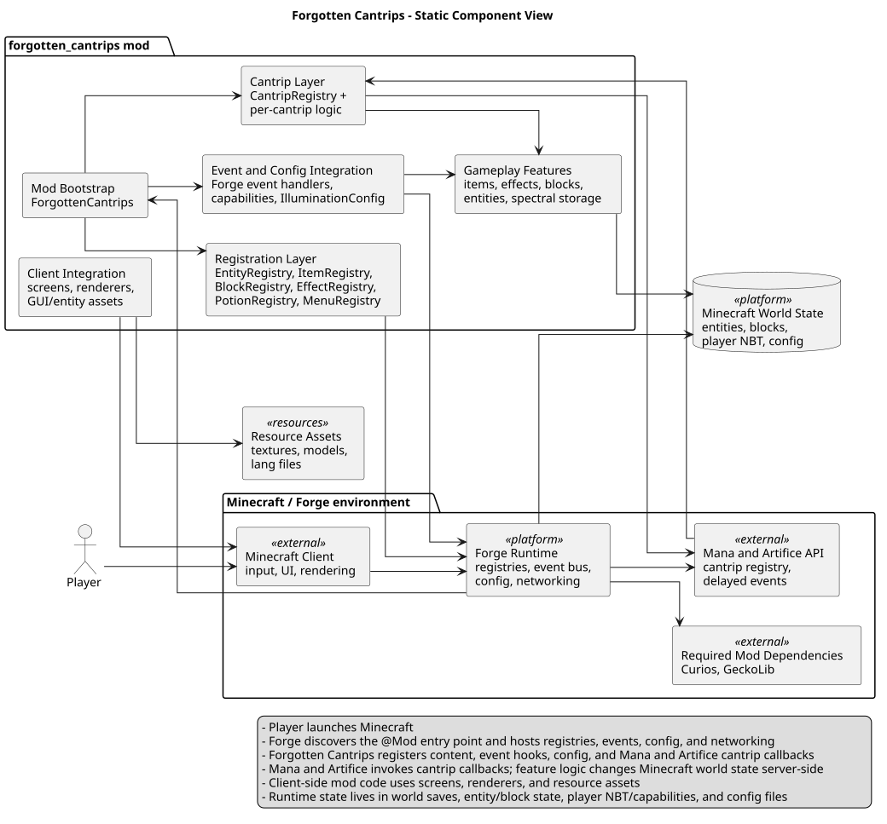
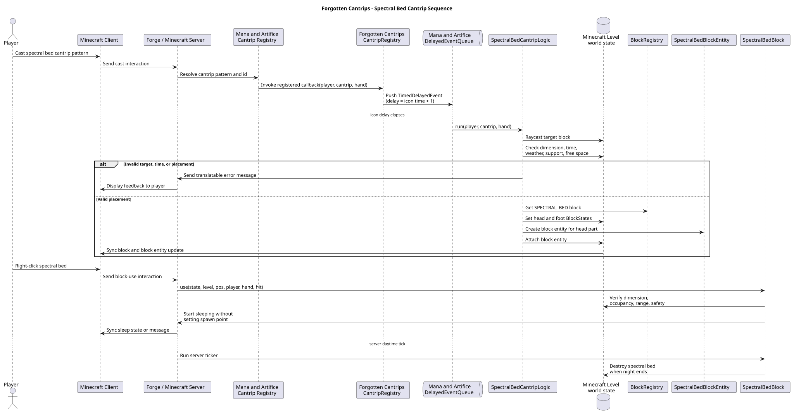
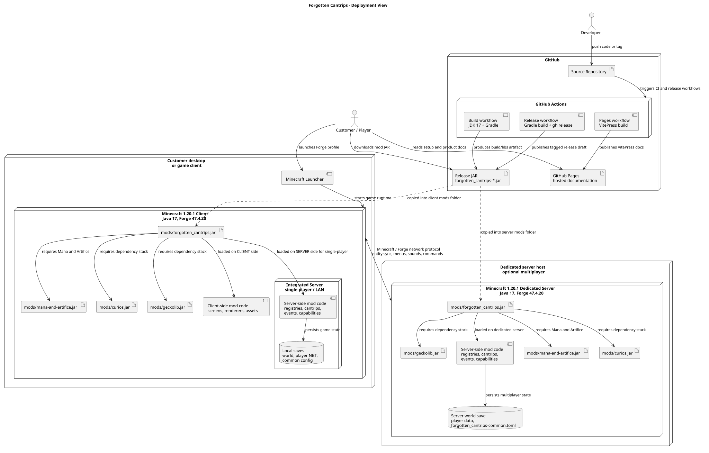

# Architecture

Forgotten Cantrips is a Minecraft Forge 1.20.1 mod that adds new Mana and Artifice cantrips, items, effects, entities, UI, and assets.

| View | Rendered diagram | Source |
|---|---|---|
| Static | [static_view.svg](static_view.svg) | [component-diagram.puml](static-view/component-diagram.puml) |
| Dynamic | [dynamic_view.svg](dynamic_view.svg) | [spectral-bed-sequence.puml](dynamic-view/spectral-bed-sequence.puml) |
| Deployment | [deployment_view.svg](deployment_view.svg) | [deployment-diagram.puml](deployment-view/deployment-diagram.puml) |

## Architectural Decisions Synthesis
The core views of this system work together to guarantee a highly stable, maintainable, and unexploitable Minecraft modding extension. These architectural pillars are governed by three core Architectural Decision Records:

* **[ADR 0001: Mod Modularity and Registry Separation](adr/0001-mod-modularity-and-registry-separation.md)**: Governs package safety and logical boundaries within the **Static View**.
* **[ADR 0002: Server-Authoritative Cantrip Validation](adr/0002-server-authoritative-cantrip-validation.md)**: Manages network boundaries and processing sequence rules detailed in the **Dynamic View**.
* **[ADR 0003: Automated CI/CD and Strict Toolchain Versioning](adr/0003-automated-ci-cd-and-strict-toolchain-versioning.md)**: Structures the continuous Integration and build lifecycle shown in the **Deployment View**.

## Static View

### Component Diagram

The component diagram shows the mod as an in-process Forge extension. Forge loads `ForgottenCantrips`, which registers content, config, event hooks, and Mana and Artifice callbacks. Cohesion is good since registries, cantrips, events, screens, renderers, and assets are separated. Coupling is strongest to Minecraft/Forge/Mana and Artifice, so upgrades need integration testing. This supports QR-001 separation, QR-002 delayed runtime work, and QR-003 CI compilation.

## Dynamic View

### Sequence Diagram: Spectral Bed Cantrip

The sequence diagram shows the Spectral Bed flow: cast, Mana and Artifice resolution, delayed execution, server-side placement validation, and world update. It crosses client input, cantrip dispatch, mod logic, server authority, and persistence. The key decision is server-validated mutation: invalid casts return feedback without changing the world.

## Deployment View

### Deployment Diagram

The deployment diagram shows GitHub Actions builds with JDK 17/Gradle, release JARs, and VitePress/GitHub Pages docs. A Forge mod JAR fits because the product runs inside Minecraft, not as a hosted service. This is simple but version-constrained: clients/servers need compatible Minecraft, Forge, Mana and Artifice, Curios, GeckoLib, Java, matching mod versions, backups, and preserved config when needed.
