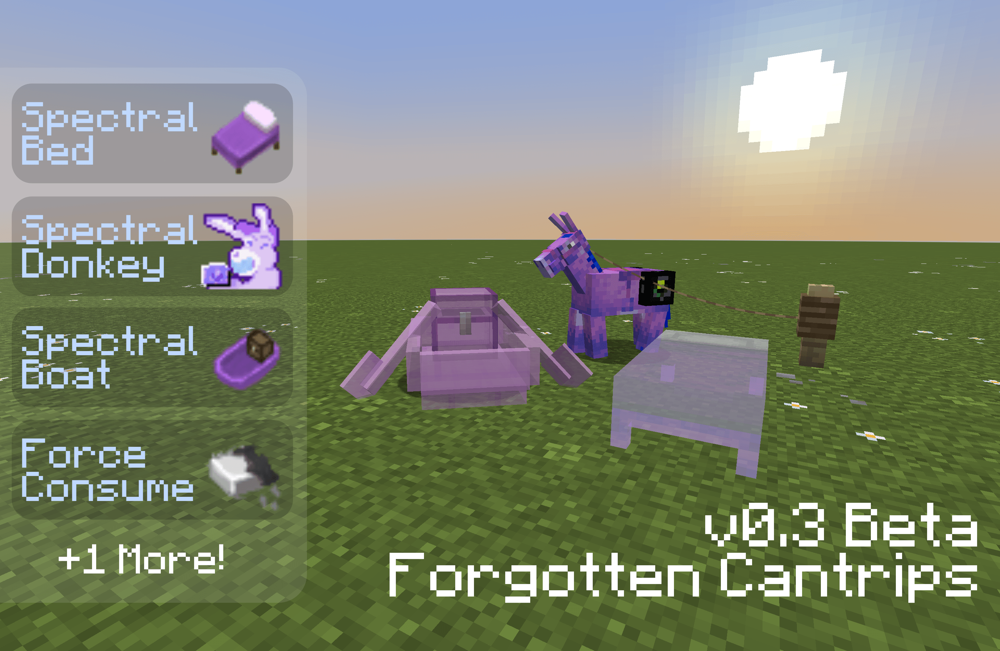

# Forgotten Cantrips

## About

Forgotten Cantrips is an addon for Mana and Artifice that expands your magical arsenal with powerful, ancient magic. To learn these lost spells, players will need to explore the world and uncover rare scrolls of forgotten knowledge.

## Features

- Spectral Bed (cantrip): Rest through the night without resetting your spawn point
- Spectral Boat (cantrip): Travel the oceans with magical storage shared with Spectral Donkey
- Lightning (cantrip): Summon lightnings
- Spectral Donkey (cantrip): Fast transportation method with magical storage shared with Spectral Boat
- Empower (cantrip): Cast this cantrip to make your next spell more powerful
- Villager Mind-Wiping cantrip: Reset trading progression
- Devour (cantrip): Forcefully eat an item from your offhand! Could be food or even sand

## Upcoming Features

- Colossus Oak (cantrip): Awaken the power of the earth and grow the tree before you to extraordinary proportions.
- Learning System: the cantrips would need to be learned somehow and we're currently designing the system for it.
